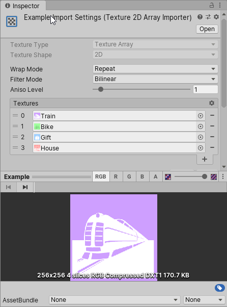
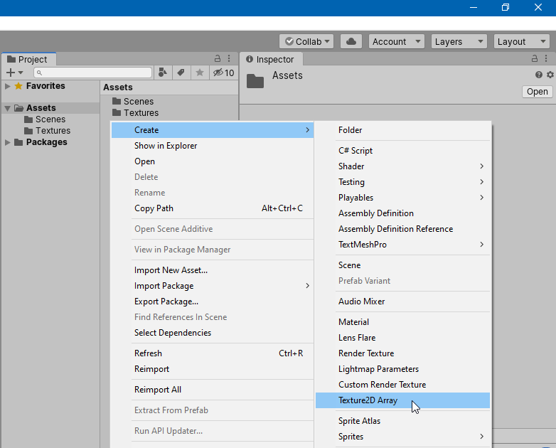
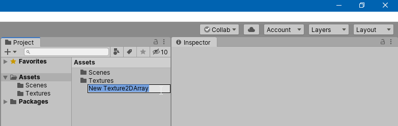
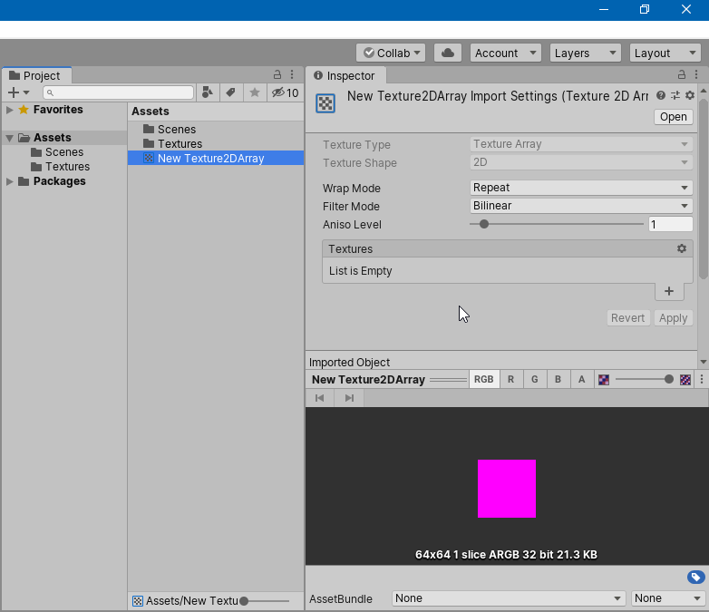
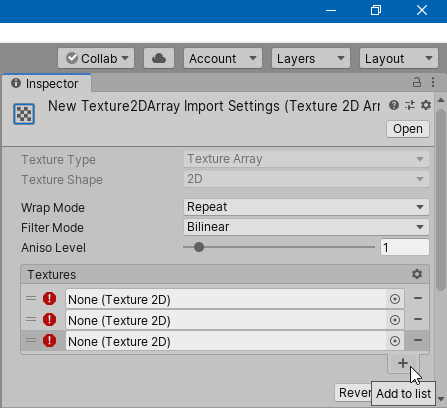
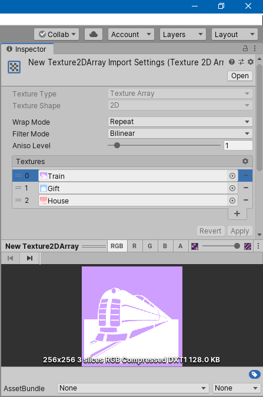

# Texture2DArray Import Pipeline for Unity

Unity has no built-in import pipeline for texture arrays in Unity 2020.1 and earlier versions yet. This is the relevant quote from their documentation:
> Currently in Unity texture arrays do not have an import pipeline for them, and must be created from code, either at runtime or in editor scripts. ([link](https://docs.unity3d.com/ScriptReference/Texture2DArray.html))

The Texture2DArray Import Pipeline package you're currently looking at tries to fill the gap of that missing import pipeline and provides an implementation to create and modify texture arrays.

This Texture2DArray Import Pipeline is an editor extension, it does not contain code that is required at runtime.




# Installation

In order to use the Texture2DArray Import Pipeline, you have to add the package to your project. As of Unity 2019.3, Unity supports to add packages from git through the Package Manager window.

In Unity's Package Manager, choose "Add package from git URL" and insert of one the Package URL you can find below.

## Package URL's

| Version  |     Link      |
|----------|:-------------:|
| 1.0.1 | https://github.com/pschraut/UnityTexture2DArrayImportPipeline.git#1.0.1 |
| 1.0.0 | https://github.com/pschraut/UnityTexture2DArrayImportPipeline.git#1.0.0 |


# How it works

## Overview

Texture2DArray Import Pipeline uses Unity's [ScriptImporter](https://docs.unity3d.com/Manual/ScriptedImporters.html). ScriptImporter allows to implement custom asset importers in C# for file formats not natively supported by Unity.

While Texture2DArray is natively supported by Unity, it just has no import pipeline yet. What I created is a ScriptImporter that handles files ending with .texture2darray as a Texture2DArray object.

Combined with a custom [ScriptedImporterEditor](ScriptedImporterEditor), I'm pretty happy with the result, as the integration feels quite smooth and you hopefully can't tell that it's not part of built-in Unity.


## Texture format and size

The texture size and format of a Texture2DArray is taken from the first input texture, the texture used for slice 0. Thus the Texture2DArray asset will have the same size and format as the texture specified in slice 0. All input textures have to use the same size and format.

Input textures are copied into the Texture2DArray with no modifications, thus they all need to match. If they don't match, you'll see an error why the Texture2DArray could not be created and the Texture2DArray is changed to solid magenta to indicate there is an issue that must be fixed.

If you want to use different texture formats/sizes for different target platforms, this is fully supported. You just need to specify the format and size in the input textures, not in the Texture2DArray asset.


## Dependency handling

A Texture2DArray asset is built from several input textures. The contents of those input textures is copied into the Texture2DArray asset.

The import pipeline registers these input textures as dependencies. This means if a texture that is used by a Texture2DArray asset changes, the Texture2DArray asset gets reimported automatically as well.

It's a really neat feature, as you don't need to hit a rebuild button to update the Texture2DArray every time you change one of its input textures.

## Platform handling

If you change the target platform in Unity, for example from PC Standalone to Android, Unity starts to reimport assets for that particular target platform you chose. This will also cause the Texture2DArray asset to get reimported and it will use the texture format and size of its input textures.


# Create Texture2DArray asset

In order to create a Texture2DArray asset, open the project window context menu via right-mouse click and choose "Create > Texture2DArray" from the menu. This will create a new Texture2DArray asset in the current directory.





Once you created the asset, it's selected in the Inspector.



A new Texture2DArray has no input textures yet. It only contains a "dummy slice" that is solid magenta to indicate you need to add textures. The Texture2DArray at this point is already fully functional though.

In order to add textures you can click the plus (+) button or just drag&drop your textures onto the list header. In the following figure, I clicked (+) three times to add three slices. As no slice has an input texture assigned yet, an error icon is shown next it.



Then add a texture to each slice and press the "Apply" button. At this point you should have a valid Texture2DArray asset as in the image below.




## Import error

If the Texture2DArray is still solid magenta after you pressed "Apply", it's very likely there was an issue with the setup. Please take a look at the Unity Console window for any import error. Open the Console from the main menu "Window > General > Console".

A common reason why importing a Texture2DArray fails, is because the input textures have different sizes or formats. Every texture added to the Texture2DArray must have the same size and format, as explained earlier, otherwise it won't work.

The error in the Console window would look like in the following image.


The error message should provide all the information required to fix the problem.


# AssetPostprocessor Example

If you want to automate a certain Texture2DArray setup every time you create a new Texture2DArray asset, you can do this using Unity's AssetPostprocessor API and hook into the OnPreprocessAsset callback to configure the texture array to your like.

```csharp
using UnityEditor;
using UnityEngine;

class Example : AssetPostprocessor
{
    void OnPreprocessAsset()
    {
        // If the asset has not imported yet...
        if (assetImporter.importSettingsMissing)
        {
            // Gets its importer and apply default settings
            var importer = assetImporter as Oddworm.EditorFramework.Texture2DArrayImporter;
            if (importer != null)
            {
                importer.filterMode = FilterMode.Point;
                importer.wrapMode = TextureWrapMode.Clamp;
                importer.anisoLevel = 0;
            }
        }
    }
}
```


